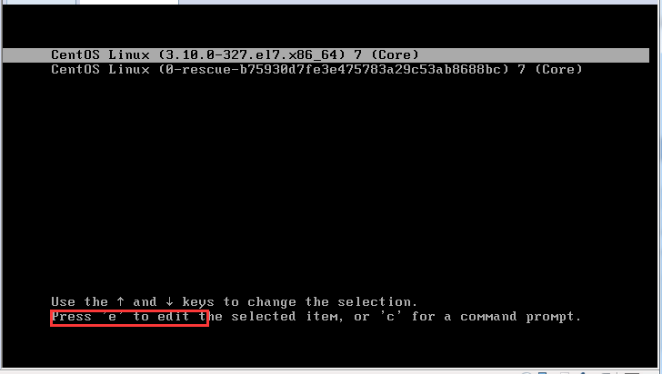
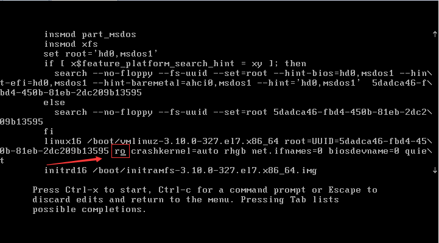
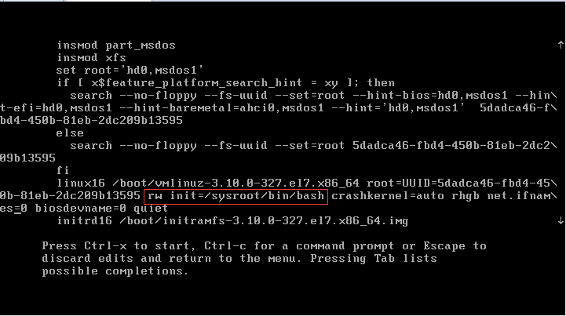
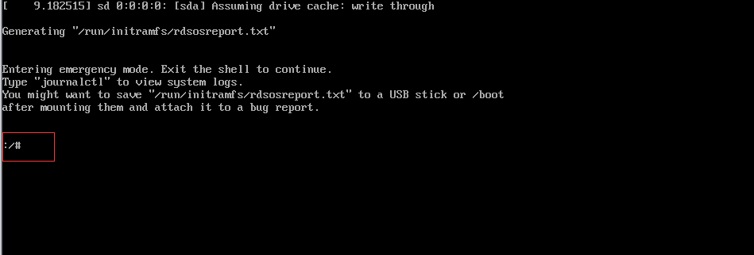
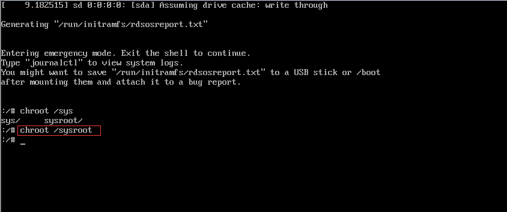
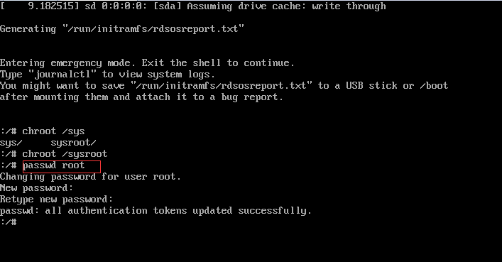
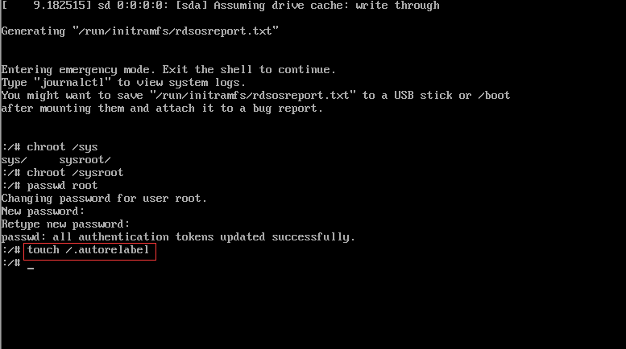
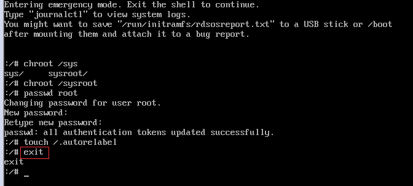
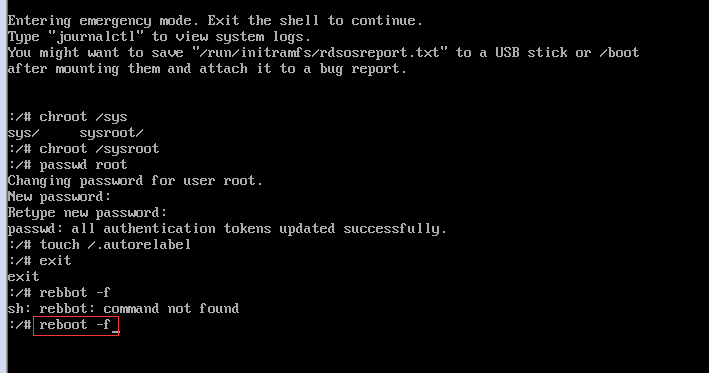

>这次是修改一台不知道密码的服务器的root用户的密码

## 开机在启动菜单按“e”，进入编辑模式

## 在里面找到 "ro"  将 "ro" 修改为 " rw init=/sysroot/bin/bash "；

修改后的内容如下：

## 修改完成之后，同时按下 " ctrl + x "，进入单用户模式；

## /sysroot &quot; 命令进入系统；

## 在终端上输入 passwd root  重置root密码;

## 用  touch /.autorelabel 更新SELinux信息;

> 我这里试了很多次只能关闭selinux才能重启成功
vi /etc/selinux/config
修改
SELINUX=disabled

## 输入 exit 退出 chroot ;

## 用 reboot -f 重启系统，用新密码登录验证；

>如果上面是关闭了selinux，这里直接reboot即可

至此修改完成root密码，系统完美登录。^_^

